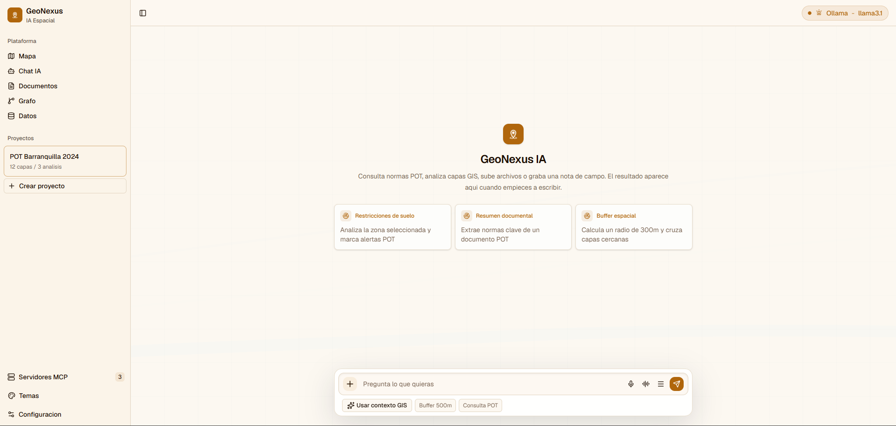

# GeoNexus

**GeoNexus** es una plataforma desktop offline-first para analisis geoespacial, consulta normativa POT, documentos tecnicos, grafos de conocimiento y herramientas GIS conectadas por IA.



## Objetivo

GeoNexus busca ser un centro de conexion para datos geograficos, documentos normativos y modelos de IA. La aplicacion permite trabajar con mapas, capas GIS, archivos tecnicos, chat IA, memoria semantica y servidores MCP, manteniendo una arquitectura local-first donde los datos pueden permanecer en la maquina del usuario.

El sistema esta pensado para urbanismo, arquitectura, planeacion territorial, analisis POT y flujos GIS donde se necesita trazabilidad: saber que documento, capa, norma o tool produjo cada respuesta.

## Funciones principales

| Funcion | Para que sirve |
| --- | --- |
| Chat IA | Consultar normas POT, pedir analisis GIS, subir archivos y ejecutar acciones asistidas por IA. |
| Mapa | Visualizar capas geograficas y resultados de analisis sobre motores de mapa configurables. |
| Documentos | Subir, conectar e indexar PDFs, DOCX, DXF, ZIP, GeoJSON y fuentes externas para consulta con citas. |
| Grafo | Explorar relaciones entre documentos, normas, zonas, capas GIS y conceptos tecnicos. |
| Servidores MCP | Administrar herramientas externas como QGIS MCP, Memory MCP, AI MCP y UI MCP. |
| Datos | Preparar la futura gestion de capas, proyectos, tablas y registros estructurados. |
| Temas | Cambiar la apariencia visual de la app sin alterar el contexto de trabajo. |
| Multi-LLM | Conectar modelos locales o cloud como Ollama, LM Studio, OpenRouter y APIs compatibles. |
| Memoria semantica | Guardar y recuperar contexto de proyectos, normas POT, conversaciones y conocimiento GIS. |
| Tool-calls GIS | Ejecutar herramientas como buffer, distancia, carga de capas, heatmap, clustering y consulta POT. |

## Arquitectura

GeoNexus sigue una arquitectura monolitica modular:

```text
React UI
  -> Tauri Commands
    -> Core Rust
      -> MCP Router
        -> MCP Servers
    -> AI Sidecar Python
      -> LLM Router
      -> ChromaDB / memoria
      -> GeoPandas / Shapely
```

Principios del sistema:

- **Offline-first:** Ollama, LM Studio, SQLite, ChromaDB y herramientas locales permiten operar sin internet.
- **Multi-LLM:** el proveedor de IA se puede cambiar sin reiniciar el sistema.
- **Multi-mapa:** la arquitectura contempla ArcGIS JS, MapLibre GL, Leaflet y Deck.gl.
- **MCP-extensible:** las herramientas GIS se conectan como servidores MCP sin recompilar el core.
- **Seguridad por defecto:** keys en keychain, allowlist localhost, tokens HMAC y schemas fijos para tools.
- **Trazabilidad:** cada tool-call debe conservar `trace_id`, servidor, duracion, proveedor IA y resultado.

## Modulos de la aplicacion

| Modulo | Ruta | Responsabilidad |
| --- | --- | --- |
| Workspace | `src/features/workspace` | Layout principal, paginas de documentos, grafo, MCP y contenedores IA. |
| Chat | `src/components/chat` | Composer, mensajes, tool-calls y entrada de usuario. |
| Mapas | `src/features/map` y `src/components/map` | Motor de mapa y adaptadores visuales. |
| Documentos | `src/features/workspace/documents` | Fuentes, biblioteca documental e indexacion visual. |
| Grafo | `src/features/workspace/graph` | Red interactiva de conocimiento y relaciones. |
| MCP | `src/features/workspace/mcp` | Vista de servidores, tools, seguridad y trazas. |
| IA | `src/features/workspace/ai-containers` | Proveedores, modelos, endpoints y configuracion. |
| Stores | `src/store` | Estado global previsto para proyectos, mapa, chat, LLM y MCP. |
| API | `src/api` | Bindings tipados hacia Tauri commands. |
| Rust crates | `crates/*` | Core, MCP router, DB y shell Tauri. |
| Python AI | `ai/*` | LLM router, memoria, GIS, documentos y grafo. |

## Servidores MCP previstos

| Servidor | Tools | Uso |
| --- | --- | --- |
| `qgis-mcp` | `buffer`, `distance`, `load_layer`, `heatmap`, `cluster` | Procesamiento GIS complejo con QGIS. |
| `memory-mcp` | `query_pot`, `store_context`, `recall` | Consulta normativa, memoria semantica y recuperacion de contexto. |
| `ai-mcp` | `switch_llm` | Cambio controlado de proveedor/modelo IA. |
| `ui-mcp` | `switch_map` | Acciones de interfaz como cambio de motor de mapa. |
| `arcgis-mcp` | Futuro | Sincronizacion con ArcGIS Online, Portal y servicios externos. |

## Stack tecnico

- **Frontend:** React 18, TypeScript, Vite, Tailwind CSS, Radix UI / shadcn-style components.
- **Desktop:** Tauri 2.
- **Rust:** crates modulares para core, MCP, DB y shell.
- **Python:** LLM Router, GeoPandas, Shapely, ChromaDB, lectores documentales y grafo.
- **Base de datos:** SQLite para datos estructurados y ChromaDB para memoria semantica.
- **IA local:** Ollama y LM Studio.
- **IA cloud opcional:** OpenRouter, OpenAI, Anthropic y APIs compatibles.

## Comandos

Instalar dependencias:

```powershell
pnpm install
```

Ejecutar frontend en desarrollo:

```powershell
pnpm run dev
```

Compilar frontend:

```powershell
pnpm run build
```

Ejecutar con Tauri:

```powershell
pnpm run tauri:dev
```

Build desktop:

```powershell
pnpm run tauri:build
```

## Estado actual

La interfaz base ya incluye paginas y componentes para Chat IA, Documentos, Grafo, Servidores MCP, temas y contenedores IA. Varias integraciones backend todavia estan como placeholders y deben conectarse progresivamente con Tauri commands, stores tipados, crates Rust y el sidecar Python.

## Seguridad esperada

- El frontend no debe llamar directamente a servidores MCP.
- React debe comunicarse con Tauri mediante wrappers en `src/api`.
- Las API keys no se guardan en SQLite ni en archivos planos.
- Los servidores MCP deben pasar por allowlist, token firmado y schema fijo.
- Los tool-calls deben registrar trazas con `trace_id`.

## Roadmap resumido

| Version | Enfoque |
| --- | --- |
| V1 | Chat IA, mapas, documentos, QGIS MCP, Memory MCP y arquitectura local-first. |
| V1.1 | Heatmaps avanzados, clustering y exportacion PDF/DXF. |
| V1.2 | Grafo de conocimiento interactivo con relaciones norma-zona. |
| V1.3 | Sincronizacion ArcGIS Online / Portal y WMS/WFS. |
| V2 | Flujos multi-agente para analisis y reportes. |

