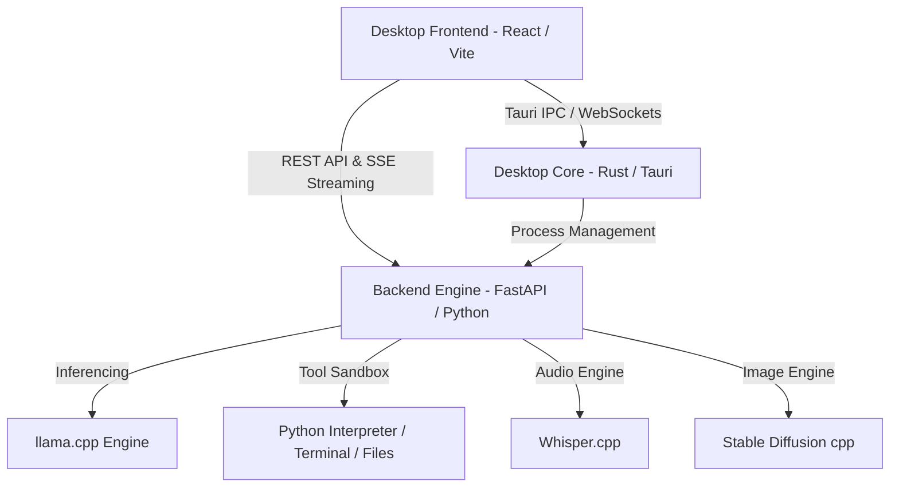

<h1 align="center" style="margin:0;">
  ⚔️ Spartan Agent
</h1>
<h3 align="center" style="margin: 0; margin-top: 0;">
  Local AI Training & Agent Platform — Desktop App
</h3>

<p align="center">
  <a href="#-features">Features</a> •
  <a href="#-getting-started">Getting Started</a> •
  <a href="#-architecture">Architecture</a> •
  <a href="#-built-on">Built On</a> •
  <a href="#-license--attribution">License & Attribution</a>
</p>

---

## About

**Spartan Agent** is a desktop platform for running, training, and orchestrating local AI models — combining a native app (Tauri + Rust), a FastAPI backend, and a React/TypeScript frontend into a single offline-first workspace.

It's built for people who want to work with LLMs, diffusion, and audio models locally: fine-tune, run inference, chat with agents and tools, manage a local model hub, and do it all without sending data to a third party by default.

## ⚡ Getting Started

> **Note:** Installer links below are placeholders — replace with your own release URLs once you have a build pipeline publishing to your own GitHub Releases.

<table>
  <tr>
    <td><b>Platform</b></td>
    <td><b>Link</b></td>
  </tr>
  <tr>
    <td><b>Windows</b></td>
    <td><i>Coming soon — Spartan Agent Releases</i></td>
  </tr>
  <tr>
    <td><b>macOS</b></td>
    <td><i>Coming soon — Spartan Agent Releases</i></td>
  </tr>
  <tr>
    <td><b>Linux (deb / AppImage)</b></td>
    <td><i>Coming soon — Spartan Agent Releases</i></td>
  </tr>
</table>

### Run from source

```bash
git clone https://github.com/Naiker12/spartan-agent.git
cd spartan-agent
npm install
npm run tauri:dev
```

## ⭐ Features

* **Local-first AI:** Run and fine-tune LLMs, diffusion, embedding, and audio models without leaving your machine.
* **Agents & Tools:** Chat with local models with tool calling, code execution, and MCP (Model Context Protocol) support.
* **Model Hub:** Discover, download, and manage models from Hugging Face and local caches in one place.
* **Fine-tuning:** LoRA, QLoRA, and full fine-tuning workflows with GPU-aware VRAM management.
* **Export & Deploy:** Export trained models to GGUF and other formats for local or remote inference.
* **Hardware support:** CPU, NVIDIA, AMD, Apple Silicon, and multi-GPU setups.
* **Offline-first, opt-in remote access:** Keep everything local, or expose your models securely when you choose to.

## 🏗️ Architecture


```mermaid
graph TD
    A[Desktop Frontend - React / Vite] -->|Tauri IPC / WebSockets| B[Desktop Core - Rust / Tauri]
    A -->|REST API & SSE Streaming| C[Backend Engine - FastAPI / Python]
    B -->|Process Management| C
    C -->|Inferencing| D[llama.cpp Engine]
    C -->|Tool Sandbox| E[Python Interpreter / Terminal / Files]
    C -->|Audio Engine| F[Whisper.cpp]
    C -->|Image Engine| G[Stable Diffusion cpp]
```

* **Frontend:** React 18, TypeScript, Tailwind CSS, Radix UI.
* **Desktop shell:** Tauri v2 (Rust) — system tray, lifecycle management, GPU acceleration.
* **Backend:** FastAPI, async, SSE token streaming, dynamic VRAM/memory management.
* **Inference engines:** `llama.cpp` for GGUF models, with CUDA / ROCm / Metal / Vulkan / CPU backends.

## 🔧 Built On

Spartan Agent's training and inference core is built on top of **[Unsloth](https://github.com/unslothai/unsloth)**, the open-source fine-tuning library, and its desktop shell started as a fork of **Unsloth Studio**. We're grateful to the Unsloth team for open-sourcing that work — it's the engine that makes the local training and inference side of this project possible.

What we're building on top: our own branding and UI direction, our own feature roadmap (see [SPARTAN_AGENT_FEATURES.md](./SPARTAN_AGENT_FEATURES.md)), and — going forward — our own modules and integrations layered on this foundation.

If you're evaluating this project, the honest picture right now is: the training/inference engine and much of the desktop shell come from Unsloth under its original license; the parts that are ours are the branding, the roadmap, and whatever we build from here. We'd rather say that plainly than have you find out later.

## 📜 License & Attribution

This project incorporates code from [Unsloth](https://github.com/unslothai/unsloth) and [Unsloth Studio](https://github.com/unslothai/unsloth/tree/main/studio):

* Core library (`spartan/`, formerly `unsloth/`) — **Apache License 2.0**, Copyright 2023-present Daniel Han-Chen & the Unsloth team.
* Desktop app (`studio/`) — **AGPL-3.0-only**, Copyright 2026-present Unsloth AI Inc.

Full license texts are included in [`LICENSE`](./LICENSE) and [`studio/LICENSE.AGPL-3.0`](./studio/LICENSE.AGPL-3.0). Per AGPL-3.0, the complete source of the desktop app — including any modifications — is available in this repository.

Original project: **https://github.com/unslothai/unsloth**

---

<p align="center">Built by <a href="https://github.com/Naiker12">Naiker12</a> and contributors.</p>
