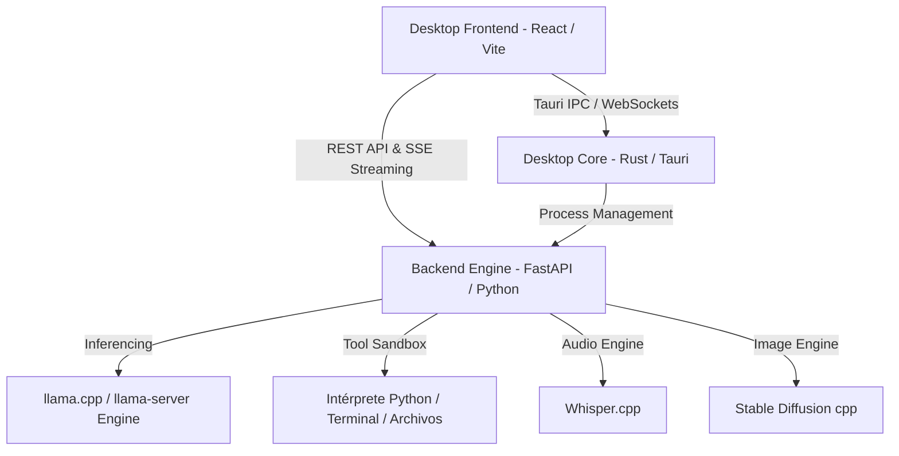

# ⚔️ Spartan Agent - Documentación Integral del Sistema y Funcionalidades

**Spartan Agent** es una suite integral de Inteligencia Artificial local, desarrollo con LLMs, orquestación de agentes autónomos y ejecución multimodal de alto rendimiento (**Rust + Tauri + React + FastAPI + llama.cpp**).

---

## 📑 Tabla de Contenidos
1. [Arquitectura General del Sistema](#1-arquitectura-general-del-sistema)
2. [Módulo de Chat e Interacción Inteligente](#2-módulo-de-chat-e-interacción-inteligente)
3. [Módulo de Agentes y Herramientas (Tools & MCP)](#3-módulo-de-agentes-y-herramientas-tools--mcp)
4. [Módulo de Hub de Modelos y Descarga](#4-módulo-de-hub-de-modelos-y-descarga)
5. [Módulo Multimodal: Imagen, Visión y Audio](#5-módulo-multimodal-imagen-visión-y-audio)
6. [Módulo de Personalización y Apariencia](#6-módulo-de-personalización-y-apariencia)
7. [Módulo de Internacionalización (i18n)](#7-módulo-de-internacionalización-i18n)
8. [Seguridad y Modo Local (Offline-First)](#8-seguridad-y-modo-local-offline-first)
9. [Resumen de Estructura de Archivos](#9-resumen-de-estructura-de-archivos)

---

## 1. Arquitectura General del Sistema

* **Frontend**: React 18, TypeScript, TailwindCSS/Vanilla CSS avanzado, Motion (Framer Motion), Lucide & HugeIcons, Radix UI.
* **Desktop Wrapper**: Tauri v2 en Rust con control de ciclo de vida, bandeja del sistema (System Tray) y aceleración por GPU.
* **Backend**: FastAPI con servidor asíncrono, streaming de tokens por SSE (Server-Sent Events), gestión de memoria y VRAM dinámica.
* **Motores de Inferencia**: `llama.cpp` nativo para modelos GGUF, soporte para CUDA (NVIDIA), ROCm (AMD), Metal (Apple Silicon), Vulkan y CPU.

---

## 2. Módulo de Chat e Interacción Inteligente

### 💬 Chat Multiturno y Streaming en Tiempo Real
* **Generación fluida token por token** con renderizado enriquecido (Markdown, LaTeX matemático vía KaTeX, diagramas Mermaid, tablas interactivas).
* **Parámetros de Inferencia en Tiempo Real**:
  * Control de Temperatura ($0.0 - 2.0$).
  * Top-P, Top-K, Min-P y Repetition Penalty.
  * Context Window (ajuste automático de $4K$ a $128K+$ tokens según VRAM).
  * System Prompt configurable por proyecto o global.
* **Gestión de Sesiones e Historial**:
  * Organización por proyectos, carpetas y etiquetas.
  * Búsqueda en texto completo sobre conversaciones pasadas.
  * Edición y bifurcación de mensajes (ramas de chat alternativas).
  * Exportación de chats a Markdown, JSON o texto plano.
* **Modo Incógnito / Temporal**: Sesiones efímeras en memoria que se destruyen al cerrar sin dejar rastro en disco.
* **Biblioteca de Prompts (Prompt Storage)**: Almacena, etiqueta y reutiliza snippets de prompts personalizados.

---

## 3. Módulo de Agentes y Herramientas (Tools & MCP)

### 🛠️ Herramientas Nativas Integradas
1. **Intérprete Python Local**: Ejecuta código Python en tiempo real dentro de un entorno aislado, captura salidas, gráficos de datos y matrices.
2. **Terminal / Shell Execution**: Ejecución de comandos del sistema con control de permisos y confirmación interactiva.
3. **Búsqueda y Navegación Web**: Capacidad de consultar fuentes web e incorporar información en tiempo real a las respuestas.
4. **Lector y Analizador de Archivos**: Análisis de código fuente, PDFs, CSVs, JSON, imágenes y documentos de texto.

### 🔌 Protocolo MCP (Model Context Protocol)
* Soporte nativo para conectar servidores MCP externos (bases de datos, APIs de terceros, herramientas de desarrollo).
* Gestión de servidores MCP en caliente mediante configuración JSON y UI dedicada.

### 🤖 Integración con Subagentes de Programación
* Conexión con agentes externos como **Claude Code**, **Codex**, **OpenClaw**, **Hermes** y **OpenCode**, usando el modelo local como backend de inferencia.

---

## 4. Módulo de Hub de Modelos y Descarga

* **Catálogo de Modelos Locales y Remotos**:
  * Explorador de modelos optimizados en Hugging Face.
  * Descarga asistida con barra de progreso, reanudación y verificación de checksums.
* **Gestión de Memoria y Modelos**:
  * Carga y descarga de modelos en RAM/VRAM en 1 solo clic.
  * Detección automática de capas a descargar en la GPU (GPU Offload layers).
  * Detección inteligente de soporte para Flash Attention 2 y contexto extendido.

---

## 5. Módulo Multimodal: Imagen, Visión y Audio

### 👁️ Visión y Análisis Visual (VLM)
* Soporte para modelos multimodales (como Llama 3.2 Vision, Qwen2-VL, etc.).
* Carga de imágenes en el chat para OCR, análisis de diagramas, descripción de capturas y razonamiento visual.

### 🎙️ Reconocimiento de Voz y Dictado (Whisper)
* Dictado de voz a texto local y en tiempo real usando modelos Whisper optimizados.
* Sin envío de audio a la nube; transcripción 100% en el dispositivo.

### 🎨 Generación de Imágenes (Stable Diffusion)
* Motor local para renderizado y generación de arte / imágenes a partir de descripciones textuales.

---

## 6. Módulo de Personalización y Apariencia

* **Temas**:
  * Modo Oscuro (Dark Mode) con contraste optimizado para programadores.
  * Modo Claro (Light Mode) nítido y elegante.
  * Modo Sistema (se adapta automáticamente al tema de Windows/OS).
* **Identidad Visual**:
  * Paleta de colores oficial Spartan.
  * Selector de paletas (Estándar, Clásica, Minimalista).
  * Personalizador de tipografías (UI, Encabezados, Código monoespaciado) y escala de fuente.
  * Personalización visual de la barra lateral (Sidebar) y accesos rápidos.

---

## 7. Módulo de Internacionalización (i18n)

* **Selector Rápido de Idioma**:
  * Acceso directo de 1 clic en la pestaña **Apariencia** y en **General**.
  * **Español (ES)**: Traducción completa de menús, diálogos, descripciones y herramientas.
  * **English (EN)**: Idioma base internacional.
  * **Detección Automática**: Detecta el idioma del sistema operativo.
* Cambio instantáneo sin necesidad de reiniciar la app.

---

## 8. Seguridad y Modo Local (Offline-First)

* **Sin Dependencia de la Nube**: Todo el motor funciona en `localhost` (`127.0.0.1`).
* **Control Total de Datos**: El historial de conversaciones, prompts, datasets y pesos de los modelos permanecen exclusivamente en tu disco duro local.
* **Sistema de Autenticación Simplificado**: Acceso directo e inmediato al entorno sin bloqueos ni requerimiento de credenciales externas.
* **Desacoplado de Repositorios Externos**: Actualizaciones automáticas y consultas de releases desvinculadas para garantizar estabilidad y privacidad.

---

## 9. Resumen de Estructura de Archivos

| Carpeta / Archivo | Función Principal |
| :--- | :--- |
| `studio/spartan-frontend/` | Aplicación visual de usuario en React + Vite + TypeScript |
| `studio/spartan_backend/` | Servidor API FastAPI, routers de inferencia, herramientas y servicios locales |
| `studio/src-tauri/` | Envoltorio de escritorio en Rust con configuración nativa |
| `spartan-cli.py` / `cli.py` | Interfaz de línea de comandos para control terminal |
| `install.ps1` / `install.sh` | Scripts de instalación automatizada para Windows y Linux/macOS |
| `SPARTAN_AGENT_FEATURES.md` | Este documento descriptivo de arquitectura y funcionalidades |
